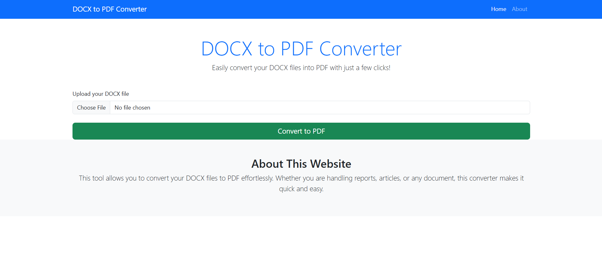
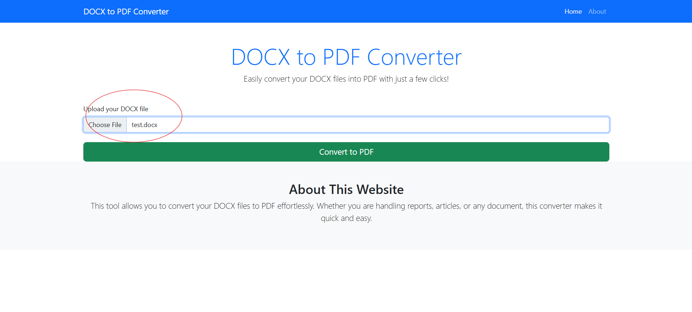
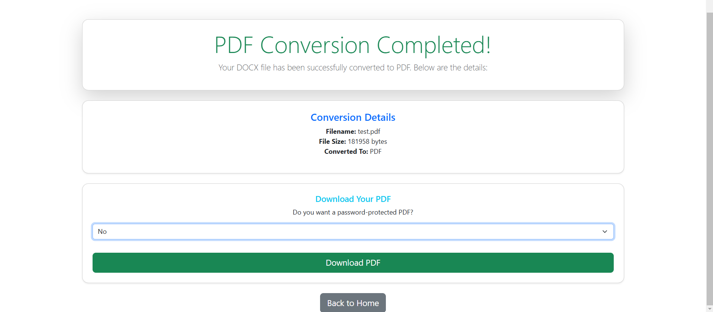
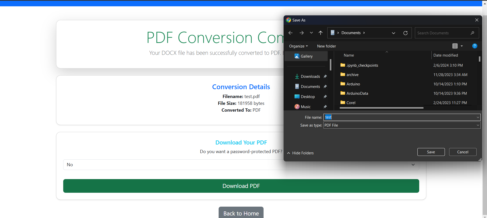
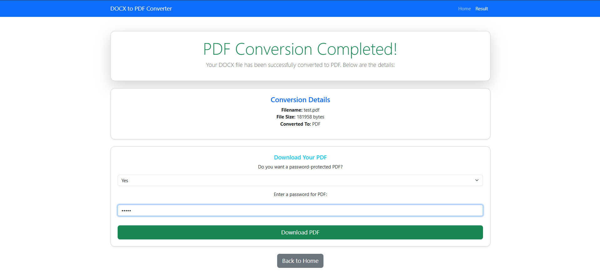
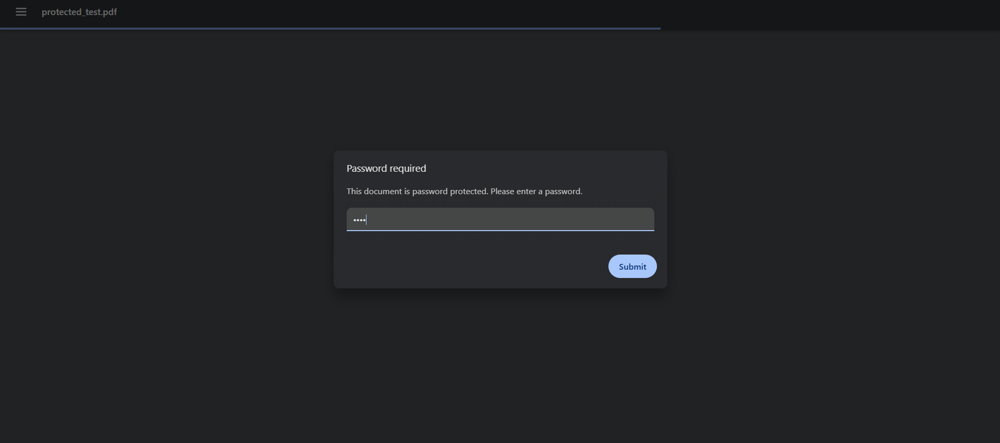
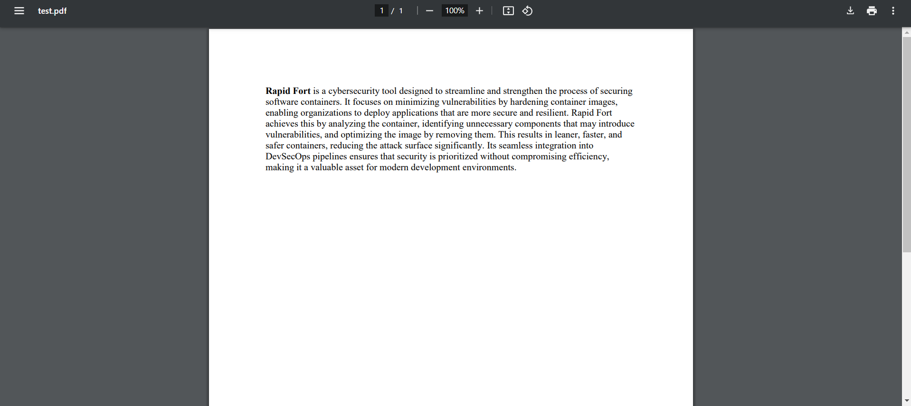

# DOCX to PDF Converter

This is a web-based application that allows users to upload a DOCX file and convert it into a PDF document. The application also provides an option for users to protect the PDF with a password. Built using **Flask**, **HTML**, and **CSS**, the application features a clean and intuitive user interface.

## Features
- **DOCX to PDF Conversion**: Upload a DOCX file and convert it to a PDF document.
- **Password Protection**: Optionally protect the generated PDF with a password.
- **User-Friendly Interface**: Simple, responsive design with smooth user experience.

## Technologies Used
- **Backend**: Python (Flask)
- **Frontend**: HTML, CSS (Bootstrap for styling)
- **PDF Conversion**: Python libraries for DOCX to PDF conversion.
- **Password Protection**: PDF password protection using Python libraries.

---

## Project Structure

The project consists of the following components:

- **app.py**: Main Flask application file where routes and logic are defined.
- **templates/**: Contains HTML files for frontend.
  - **index.html**: The main page where users upload their DOCX file.
  - **result.html**: The page that shows the converted PDF and gives options for downloading.
- **static/**: Contains CSS files and other static resources for styling.
  - **style.css**: Custom styles for the web app.

---

## Frontend Process

### 1. **Home Page (First Page)**

The user is presented with a simple and clean upload interface. Here, they can select the DOCX file they wish to convert to PDF.



#### Description:
- The page contains a title, an upload form, and a button to submit the file.
- The form accepts only `.docx` files, and a success or error message is shown based on user actions.

### 2. **Home Page After Choosing the File**

Once the user selects a DOCX file and is ready to convert, the form will display the file name and allow them to proceed.



#### Description:
- The page updates with the selected file name and the user can now click the **Convert to PDF** button to proceed with the conversion.

### 3. **Second Page (Result Page)**

This is the page shown after the user uploads their file and the conversion is complete. It displays the converted PDF and options for download.



#### Description:
- The result page shows the filename, file size, and a button to download the PDF.
- The user can choose to either download the PDF without a password or protect it with a password.

### 4. **Second Page Showing PDF Downloaded Without Password Protection**

If the user opts not to protect the PDF, they will be able to directly download the PDF without any password prompt.



#### Description:
- The page shows a link to download the PDF without any password protection.
- The user can click the download button to retrieve their PDF.

### 5. **Second Page with Password Protection**

If the user chooses to password-protect the PDF, the page will show a password input field.



#### Description:
- The user is prompted to enter a password for the PDF before downloading.
- After entering the password, the user can click **Download PDF** to get the password-protected PDF.

### 6. **Showing PDF with Password Protection**

If the user tries to open the PDF after applying password protection, they will be asked for the password.



#### Description:
- The user must enter the password to open the protected PDF.
- This ensures that the PDF remains secure and can only be accessed by the intended recipient.

### 7. **Showing PDF After Conversion**

Once the PDF is successfully converted, the application allows users to download the file or further customize it as needed.



#### Description:
- The PDF file is ready for download.
- Users can choose to download it with or without a password, depending on their preference.

---
## How to Use the Project

Follow the steps below to run the application locally on your machine.

### Prerequisites

Before starting, make sure that you have the following software installed on your system:

1. **Python 3.x**: The project is built using Python. You can download Python from [here](https://www.python.org/downloads/). Check your Python version using the command:

    ```bash
    python --version
    ```

2. **Pip**: Python's package installer is used to install the necessary dependencies. Check if you have pip installed by running:

    ```bash
    pip --version
    ```

   If it's not installed, you can install it by following the instructions on [pip installation](https://pip.pypa.io/en/stable/installation/).

### Step-by-Step Instructions

#### 1. Clone or Download the Project

First, clone the project repository or download it as a ZIP file.

- **Clone the repository** using Git:

    ```bash
    git clone https://github.com/your-username/your-repository-name.git
    ```

- Alternatively, **download** the ZIP file from GitHub and extract it to a folder.

#### 2. Set Up a Virtual Environment (Recommended)

It’s highly recommended to create a virtual environment to manage the dependencies and avoid conflicts with other projects.

- **For Windows**:

    ```bash
    python -m venv venv
    ```

- **For macOS/Linux**:

    ```bash
    python3 -m venv venv
    ```

Once the virtual environment is created, activate it:

- **For Windows**:

    ```bash
    venv\Scripts\activate
    ```

- **For macOS/Linux**:

    ```bash
    source venv/bin/activate
    ```

You should see `(venv)` at the start of your command prompt indicating that the virtual environment is active.

#### 3. Install Project Dependencies

The project’s dependencies are listed in the `requirements.txt` file. Install them by running:

```bash
pip install -r requirements.txt
```

#### 4. Run the Flask Application

Once the dependencies are installed, you can run the Flask app. In the project directory, execute the following command:

- **For Windows**:

    ```bash
    python app.py
    ```

- **For macOS/Linux**:

    ```bash
    python3 app.py
    ```

By default, the Flask application will run on `http://127.0.0.1:5000/`. After running the command, you should see an output similar to this:

```bash
 * Running on http://127.0.0.1:5000/ (Press CTRL+C to quit)

